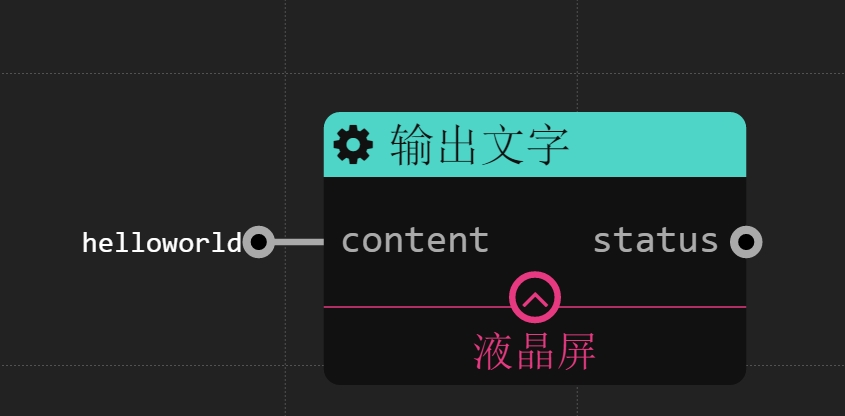

1602液晶屏
======
## 输出文字

### 描述

在液晶屏幕上显示文字

### 输入

`content`: 字符类型. 需要在液晶屏上显示的字符内容

### 输出

`status`: 布尔值. 如果成功，输出true，反之false

### 样例

给content赋默认参数“helloworld”，启动后液晶屏会输出“helloworld”

## 按键

###

液晶屏上的5个按键：left，right，up，down，select

同时按下多个无效

### 输入

`trigger`: 任何类型. 触发信号, 每来一次输入做一次是否按下的判断

### 输出

`bool`: 布尔值. true表示按键被按下, false表示没有按下

### 样例

每隔0.5s查询left和right哪个被按下，并在液晶屏上显示出被按下的按键名